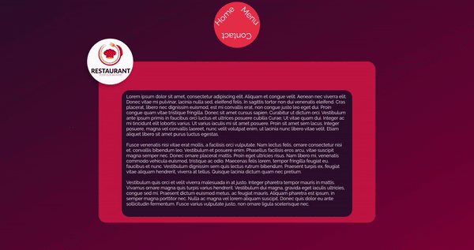

# Project Name

> Restaurant menu page created entirely from JS code.

Additional description about the project and its features.

## Built With

- JavaScript

## Live Demo

[Live Demo Link](https://edlingao.github.io/RestaurantJS/)

## Getting Started

This project uses npm

### Prerequisites
- npm
- vs code
- live server

### Setup
- npm install
- start live server on dist/index.html
### Install
- npm run build
### Usage

## Authors

👤 **Author1**

- Github: [@githubhandle](https://github.com/edlingao)

## 🤝 Contributing

Contributions, issues and feature requests are welcome!

## Show your support

Give a ⭐️ if you like this project!

## 📝 License

This project is [MIT](lic.url) licensed.
